# Lab 2: Configuring Custom Alerts and Dashboards in Wazuh

## Objective
The purpose of this lab is to create custom Wazuh rules, generate alerts from system logs, and visualize those alerts in the Wazuh Dashboard. This lab covers both Linux and Windows environments and demonstrates end-to-end verification of custom rules.

## Lab Steps and Documentation

### 1. Create Test Files for FIM Alerts
- Created custom files for Wazuh File Integrity Monitoring (FIM) testing.
- Linux test file: `C_WazuhTest_test.txt`
- Windows test file: `C_WazuhTest_test.txt`
- Screenshots:
  - 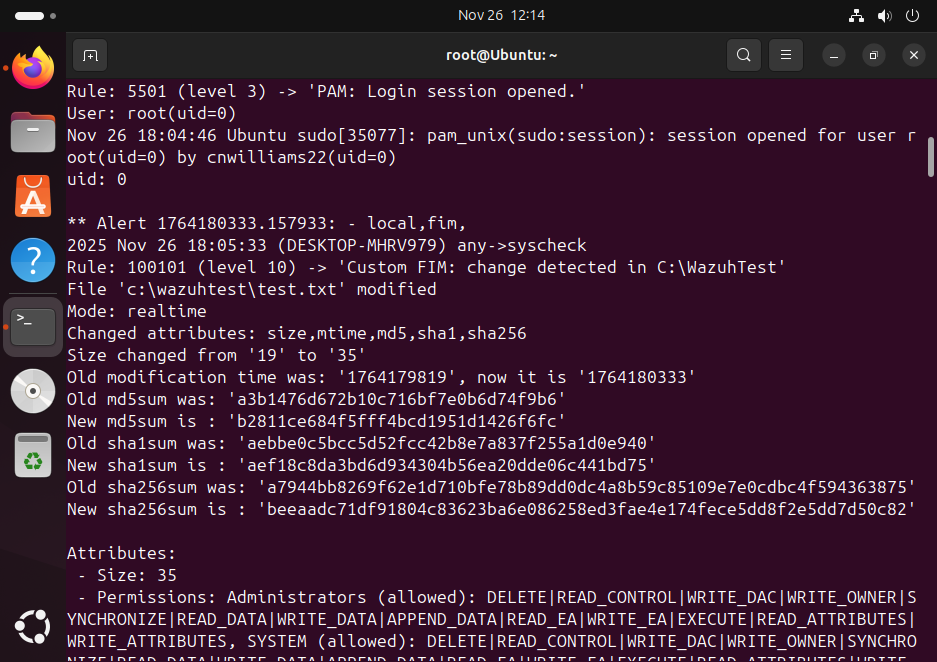
  - 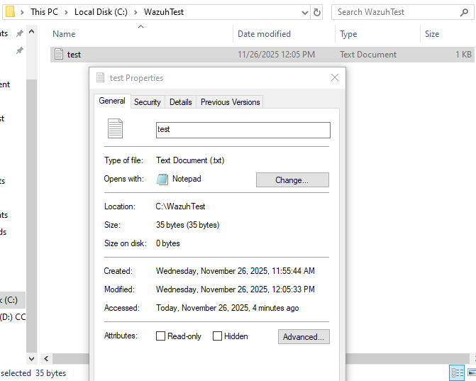

### 2. Verify FIM Alerts in Wazuh Dashboard
- Checked that Wazuh detected changes in the FIM test files.
- Screenshots:
  - 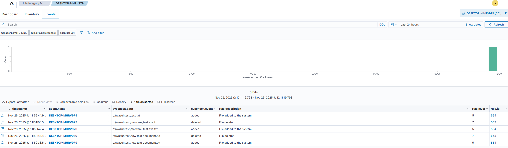
  - 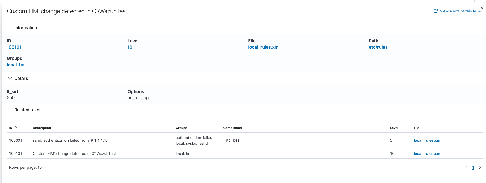

### 3. Generate Alerts from System Logs
- Triggered alerts using system activity and custom test logs.
- Linux alerts:
  - 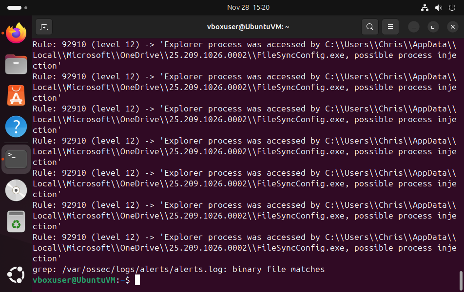
  - 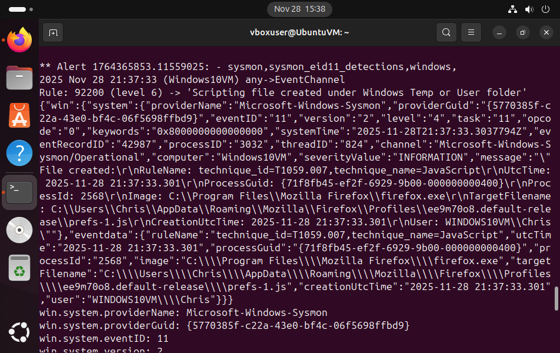
- Windows alerts:
  - 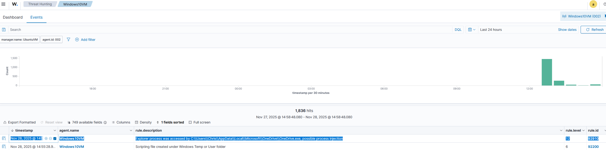
  - 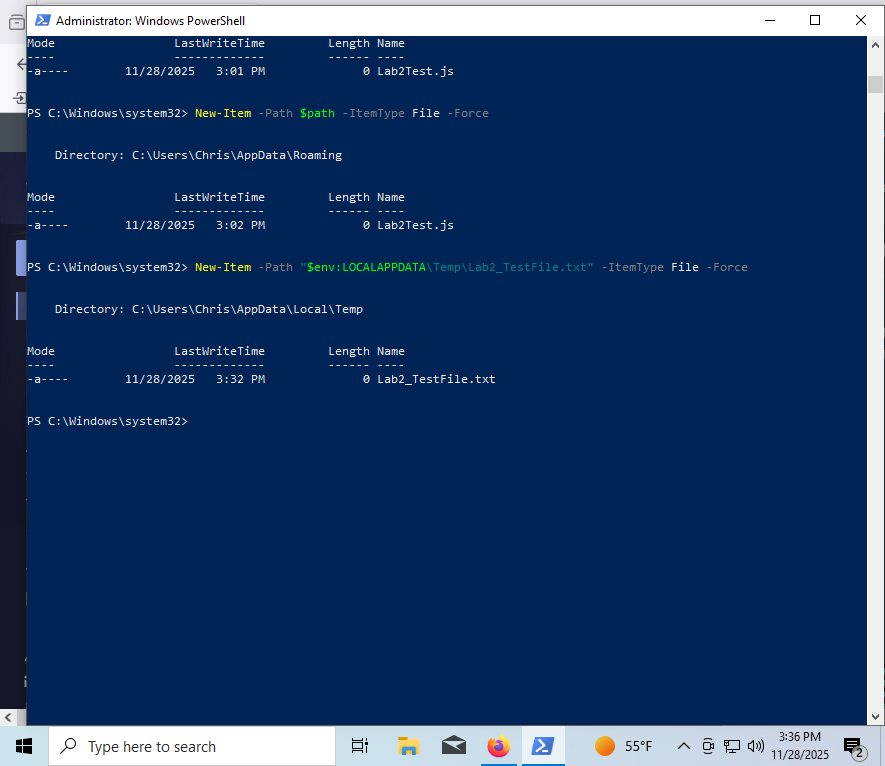

### 4. Create Custom Wazuh Rules
- Created custom XML rules:

<group name="custom_lab2_rules">
  <rule id="100100" level="10">
    <match>CUSTOM_LAB2_TEST</match>
    <description>Lab 2 - Custom alert triggered by CUSTOM_LAB2_TEST</description>
  </rule>

  <rule id="100101" level="8">
    <match>CUSTOM_LAB2_TEST2</match>
    <description>Lab 2 - Custom alert triggered by CUSTOM_LAB2_TEST2</description>
  </rule>
</group>

- Verified rules with `wazuh-logtest`.  
- Screenshot: 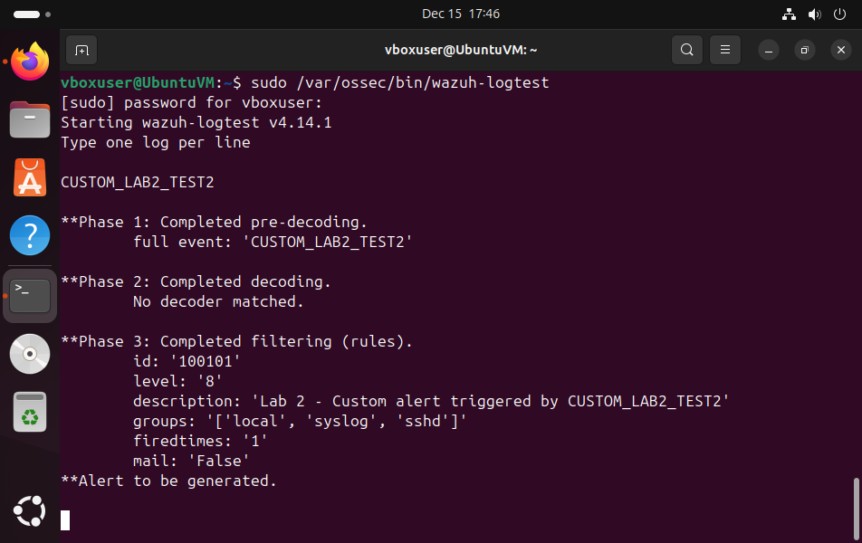

### 5. Verify Custom Alerts in Wazuh Dashboard
- Confirmed custom alerts appear in the Dashboard:
  - Discover view for rule 100101: 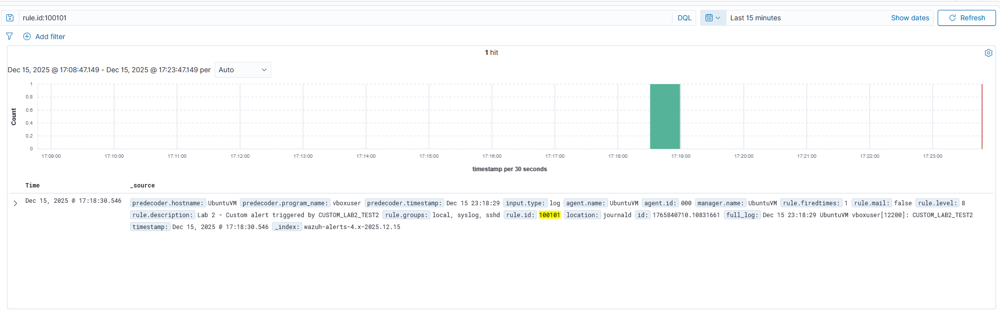
  - Rule definition in Management → Rules: 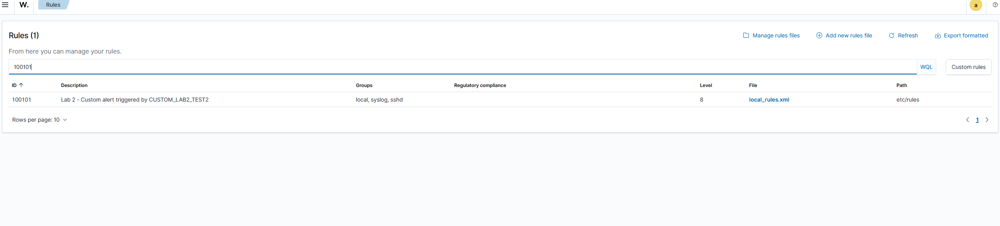

### 6. Verify Alerts in Ubuntu Terminal
- Used `tail` and `grep` to confirm custom alerts are logged in `alerts.json`.
- Screenshot: 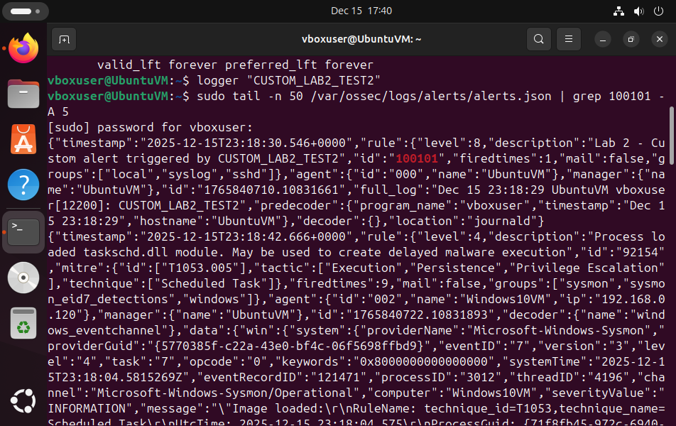

## Summary
- Custom rules `100100` and `100101` were successfully created and tested.
- Alerts were generated and verified in both Linux and Windows environments.
- Dashboard visualizations confirmed proper integration of custom rules.
- All objectives for Lab 2 have been completed and documented.
