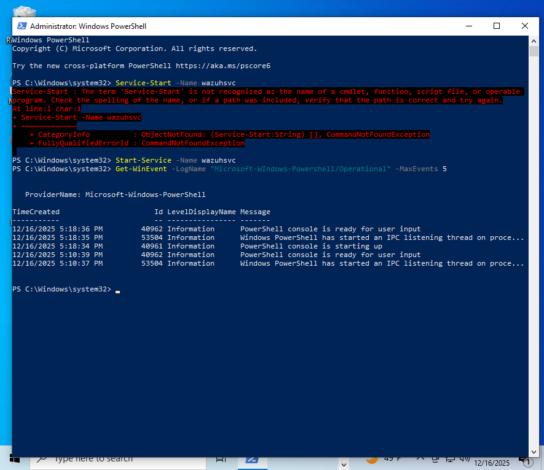
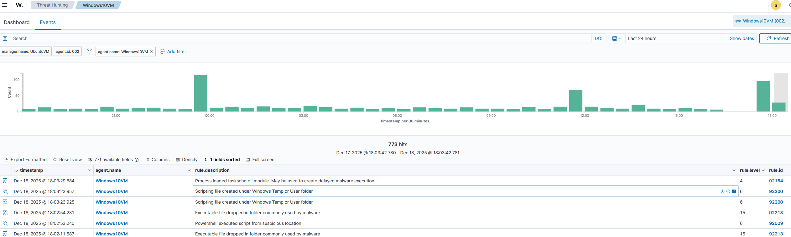
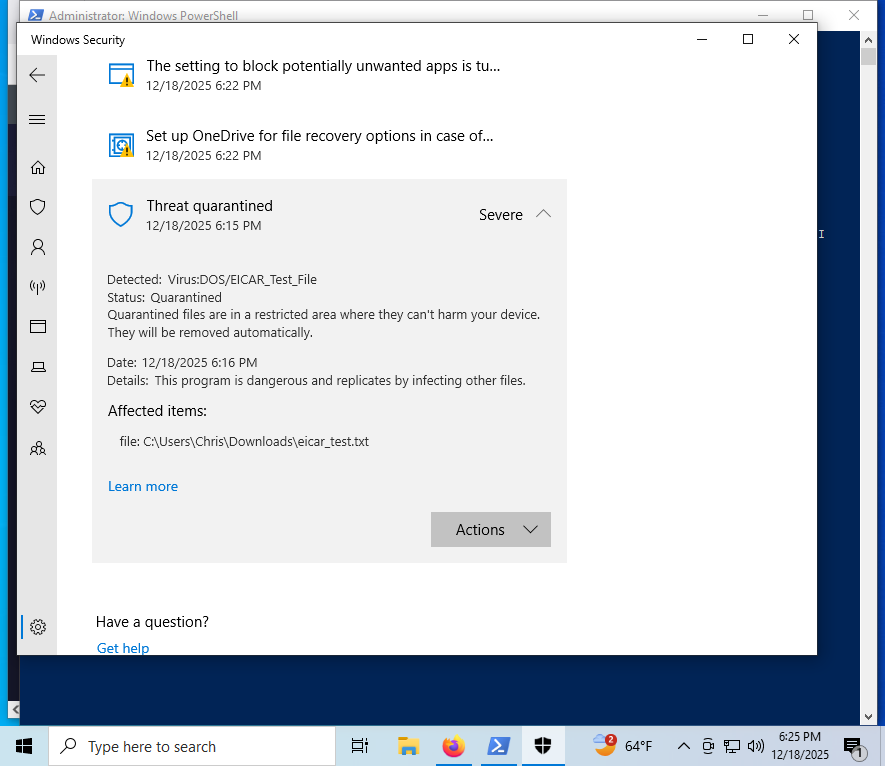

# Lab 4 – Malware Simulation and Endpoint Detection

## Overview
This lab demonstrates malware simulation and endpoint detection on a Windows 10 VM using Wazuh. Activities include PowerShell script creation, executable staging, and safe EICAR test file execution. Alerts are observed in Wazuh and endpoint antivirus telemetry, providing a realistic SOC-style detection scenario.

## Lab Objectives
1. Verify Windows PowerShell logging is enabled and events are ingested by Wazuh.
2. Simulate malware behaviors:
   - PowerShell script creation in user/Temp folders
   - Executable dropped in commonly used malware directories
   - EICAR test file execution to trigger antivirus detection
3. Observe and document Wazuh alerts and endpoint protection events.
4. Map detected behaviors to MITRE ATT&CK techniques.

## Environment
- Windows 10 VM
- Wazuh Agent installed and running (`wazuhsvc`)
- Wazuh Manager receiving events
- Microsoft Defender enabled

## Step-by-Step Actions and Results

### 1. Verify Wazuh Agent and Windows Event Ingestion
1. Confirm Wazuh Agent is active:  
   
2. Generate a simple PowerShell test event:  
   ```powershell
   Write-Output "Lab 4 PowerShell Test Event"
   ```
   - Wait 30–60 seconds  
   - Verify ingestion in Wazuh Dashboard  
   
3. Confirm PowerShell Operational Logging is enabled (Event ID 4103):  
   

### 2. Malware Simulation

#### 2.1 Simulated PowerShell Script Drop
- Created a benign PowerShell script in `$env:TEMP`:
```powershell
$path = "$env:TEMP\update_check.ps1"
"Write-Output 'Simulated malware execution test'" | Out-File -Encoding ASCII $path
powershell -ExecutionPolicy Bypass -File $path
```
- Observed Wazuh alert:
  - Rule ID: 92200
  - Severity: 6  
  

#### 2.2 Simulated Executable Drop
- Created a harmless executable file in Temp:
```powershell
$exePath = "$env:USERPROFILE\AppData\Local\Temp\svchost.exe"
"Not a real executable – simulated malware test" | Out-File -Encoding ASCII $exePath
```
- Observed Wazuh alert:
  - Rule ID: 92213
  - Severity: 10–15  
  

#### 2.3 EICAR Test File (Antivirus Detection)
- Created the EICAR test string:
```powershell
$eicar = 'X5O!P%@AP[4\PZX54(P^)7CC)7}$EICAR-STANDARD-ANTIVIRUS-TEST-FILE!$H+H*'
Set-Content -Path "$env:USERPROFILE\Downloads\eicar_test.txt" -Value $eicar -Encoding ASCII
```
- Microsoft Defender quarantined the test file at 6:16 PM  
- Wazuh did not generate a high-severity alert, but Defender protection was confirmed  
  

## Observations
- Multiple Wazuh alerts were generated for rapid file creation and execution events; this is normal and mirrors real-world malware behavior.
- Defender successfully intercepted the EICAR test string before Wazuh could escalate the event.
- This lab demonstrates defense-in-depth: Wazuh detects scripting and executable drops, while endpoint antivirus handles immediate threat containment.

## MITRE ATT&CK Mapping

| Step | Technique | Description |
|------|-----------|-------------|
| PowerShell script creation | T1059 – Command and Scripting Interpreter | Simulated malicious script execution |
| Executable staged in Temp | T1036 – Masquerading / T1105 (conceptual) | Executable file dropped in commonly used malware directory |
| EICAR AV detection | T1204 – User Execution | Safe simulation of malware blocked by endpoint AV |

## Conclusion
Lab 4 successfully demonstrates malware simulation and endpoint detection using Wazuh. Alerts for script creation and executable staging were captured, and the EICAR test confirmed Microsoft Defender’s real-time protection. All steps were safely executed and documented with screenshots for professional SOC-style reporting.
