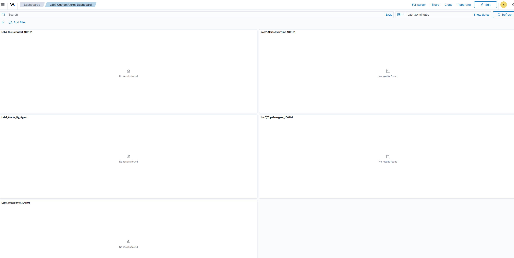
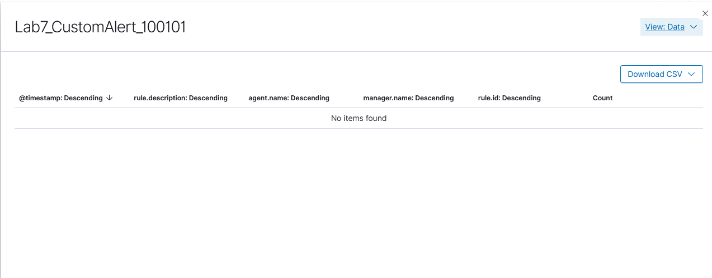
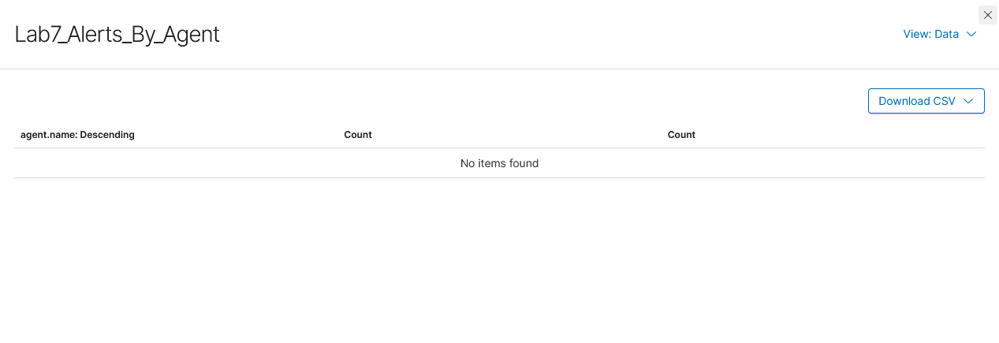
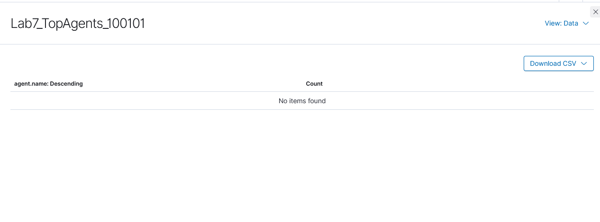
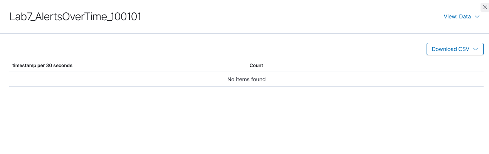
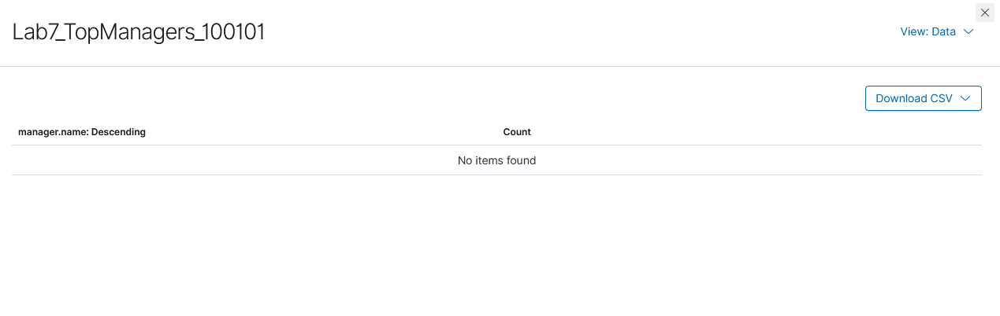

# Lab 7: Reporting and Dashboard Optimization

## Objective
Create and customize dashboards and reports in Wazuh for monitoring a Windows VM. Apply filters, save views, create visualizations/widgets, and generate reports for documentation, even in a low- or no-event environment.

## Environment
- **Windows 10 VM:** DESKTOP-MHRV979 monitored by Wazuh agent (`wazuhsvc`)
- **Wazuh Manager:** Ubuntu server
- **Wazuh web interface:** Explore, Dashboard, Visualize, Discover tabs

## Lab Steps and Documentation

### 1. Verify Wazuh Agent
- Confirmed Wazuh agent running as `wazuhsvc` in Windows Services Manager.
- 
- Notes: Agent connectivity to Wazuh manager verified; service running normally.

### 2. Saved Filtered View in Discover
- Added filters in Discover for:
  - `agent.name` → DESKTOP-MHRV979  
  - `data.win.system.eventID` → 4720, 4728 (others not available)  
  - Optional: `rule.level` → moderate+ (adjusted using available operators)
- Saved the filtered view as **Lab7_Filters**.
- 
- Notes: Filters persisted only in Discover; Threat Hunting does not retain filters.

### 3. Applied Same Filters in Threat Hunting
- Mirrored filters from Discover to Threat Hunting.
- 
- Notes: No events were present; dashboard shows normal state despite applied filters.

### 4. Exported Filtered Data
- In Discover → Reporting → Generate CSV.
- Exported CSV file of filtered events as **lab7-03_Discover_FilteredExport.csv**.
- Notes: CSV is linked below; file size may be small due to no matching events.
- [Filtered Export CSV](Assets/lab7-03_Discover_FilteredExport.csv)

### 5. Created Dashboard Widgets / Visualizations
- Created 3 widgets on **Lab7_CustomDashboard** using saved Lab7_Filters view:
  1. **Top Agents**
     - Type: Vertical Bar
     - Data source: Lab7_Filters
     - Metric: Count of events
     - 
  2. **Alerts Over Time**
     - Type: Line chart / Vertical Bar
     - Data source: Lab7_Filters
     - Metric: Count of events
     - 
  3. **Top Managers**
     - Type: Donut / Pie
     - Data source: Lab7_Filters
     - Metric: Count of events
     - 

### 6. Dashboard Overview
- Opened **Lab7_CustomDashboard** to display all widgets together.
- Notes: Dashboard layout and visualization configuration confirmed; empty counts demonstrate proper setup.

## Key Observations
- Wazuh filters and visualizations function even with zero matching events.
- Saved Discover views allow persistent filtering for reporting.
- Threat Hunting tab does not persist filters between sessions.
- Dashboard widgets can be configured from saved Discover views.
- CSV exports capture filtered data for documentation, even if empty.
- Custom dashboard layout preserved all created widgets.

## References
- Wazuh Documentation: [https://documentation.wazuh.com/current/](https://documentation.wazuh.com/current/)
- Wazuh Dashboard and Visualizations: [https://documentation.wazuh.com/current/user-manual/kibana/index.html](https://documentation.wazuh.com/current/user-manual/kibana/)
- Microsoft Event IDs: [https://docs.microsoft.com/en-us/windows/security/threat-protection/auditing/event-4720](https://docs.microsoft.com/en-us/windows/security/threat-protection/auditing/event-4720)
